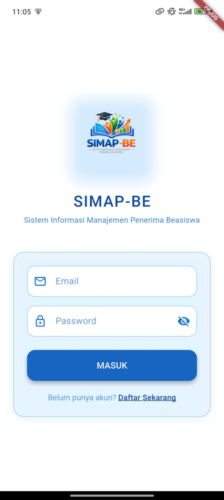
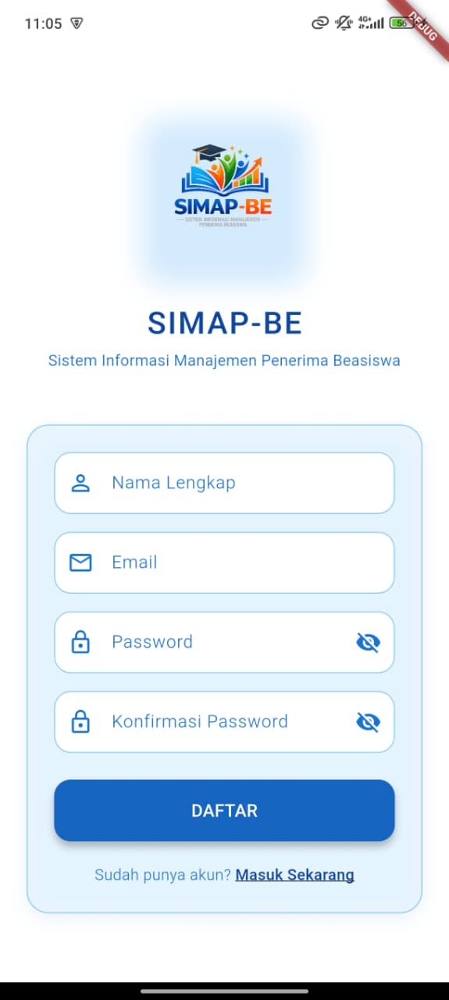
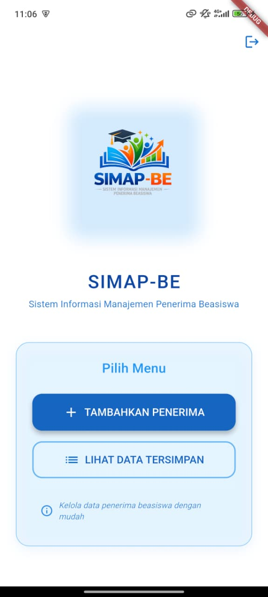

Baik Putu, aku rapikan isi README kamu supaya lebih **terstruktur, profesional, dan lengkap**. Berikut versi yang sudah diperbaiki:

---

```markdown
# 📱 SIMAP-BE – Sistem Informasi Pemetaan Bantuan Beasiswa

**SIMAP-BE** adalah aplikasi mobile berbasis Flutter yang dirancang untuk membantu proses **pendataan dan pemetaan penerima bantuan beasiswa** secara terstruktur dan berbasis lokasi.  
Proyek ini dikembangkan sebagai bagian dari **UAS**.

---

## 👨‍💻 Tim Pengembang
- I Gede Desnata Adiaksa Putra (2301010089)  
- I Wayan Sudarma (2301010050)  
- I Putu Jantaka Ari Koli (2301010040)  

---

## 🔗 Desain & Dokumentasi

### 🎨 Desain UI/UX (Figma)
[Link Figma](https://www.figma.com/design/In6Nji8Kkbcojd0JVumlNk/Untitled?node-id=572-341&t=3b7SYhRoYnsdkcaT-1)

### 📑 Dokumentasi UML & Penjelasan Aplikasi
[Link Softcopy UML](https://docs.google.com/document/d/1F4dCa7z_2F78lp8ZSBSVvH8AG2Ivlr5rb8e0XW-BXZc/edit?usp=sharing)

---

## 🖼️ Screenshot Aplikasi

### 🔐 Halaman Login
<p align="center">
  
</p>

### 📝 Halaman Register
<p align="center">
  
</p>

### 🏠 Halaman Home
<p align="center">
  
</p>

### 📋 List Penerima Beasiswa
<p align="center">
  
</p>

### ➕ Tambah Penerima Beasiswa
<p align="center">
  
</p>

### ✏️ Edit Data Beasiswa
<p align="center">
  
</p>

---

## ✨ Fitur Utama
- ✅ **Autentikasi Pengguna** – Login & Register dengan Firebase Auth  
- ✅ **Input Data Beasiswa** – Form lengkap dengan validasi  
- ✅ **Geolokasi Otomatis** – Ambil koordinat & alamat dengan GPS  
- ✅ **Upload Dokumen** – Foto KTP & bukti pendukung (disimpan lokal)  
- ✅ **Manajemen Data** – Lihat, Edit, dan Hapus data penerima  
- ✅ **Tampilan Modern** – Desain putih-biru profesional  
- ✅ **Responsif & User-Friendly** – UI/UX intuitif  

---

## 🧩 Teknologi yang Digunakan

| Teknologi              | Kegunaan                        |
| ---------------------- | ------------------------------- |
| **Flutter**            | Framework UI cross-platform     |
| **Dart**               | Bahasa pemrograman              |
| **Firebase Auth**      | Autentikasi pengguna            |
| **Firestore**          | Database NoSQL real-time        |
| **Local Storage**      | Penyimpanan foto di perangkat   |
| **Geolocator**         | Ambil koordinat GPS             |
| **Geocoding**          | Konversi koordinat ke alamat    |
| **Image Picker**       | Ambil gambar dari kamera/galeri |
| **Permission Handler** | Manajemen izin aplikasi         |
| **Path Provider**      | Akses path penyimpanan lokal    |

---

## 📱 Alur Aplikasi
1. **Login/Register** → User autentikasi dengan email & password  
2. **Home Menu** → Pilih tambah data atau lihat data  
3. **Tambah Data** → Isi form, ambil lokasi, upload foto, simpan  
4. **Lihat Data** → Daftar semua penerima, bisa edit/hapus  
5. **Logout** → Kembali ke halaman login  

---

## 🚀 Cara Menjalankan Aplikasi
1. Clone repository ini:
   ```bash
   git clone https://github.com/desnata/SIMAP-BE.git
   cd SIMAP-BE
   ```
2. Install dependencies:
   ```bash
   flutter pub get
   ```
3. Jalankan aplikasi:
   ```bash
   flutter run
   ```
4. Pastikan sudah mengatur Firebase Auth & Firestore sesuai dokumentasi.

---

## 📄 Lisensi
Proyek ini dilisensikan di bawah **MIT License**.

---

## 🙏 Acknowledgments
- Flutter Team  
- Firebase Team  
- Package contributors: geolocator, image_picker, permission_handler  
```

